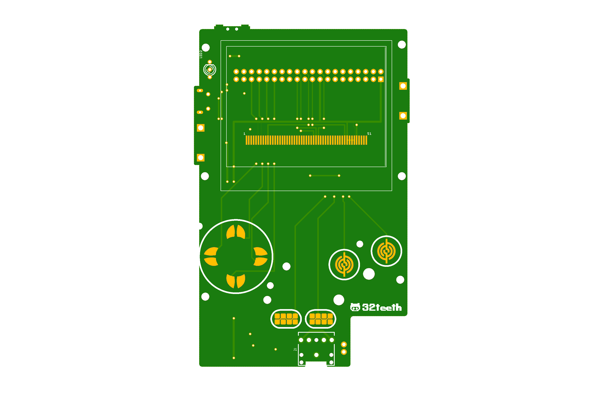
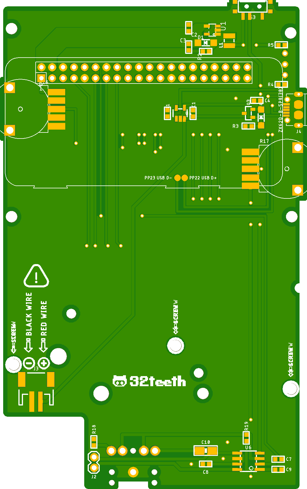

# Gaboze Lite Edition
Gaboze Lite is an even more no frills version of the Game Boy Pocket and Raspberry Pi Zero.

## What Did We Do?

* [x] Lakka Only Release *(You Can Still Have RetroPie)*
* [x] TP4056 Module Removed for more efficient Texs Instruments
* [x] 5V Power Rail
* [x] Full USB OTG Support
* [x] New Button Library With Better Actuation
* [x] Two Buttons Only

## Why Did We Do This

Well, we slimmed it down to a two button build (you can always wire more on your own). After market evaluation, and to keep costs lower.

## Preview

| Top  | Bottom |
| ---- | ------ |
|      |        |

